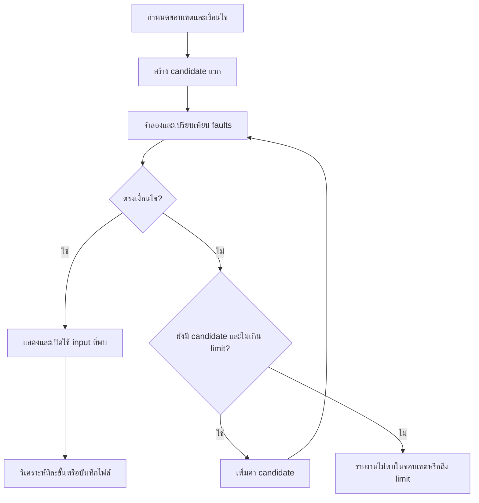

# Memory Policy Lab (C)

มินิโปรเจกต์วิชา Operating Systems: ทดลอง FIFO, LRU, Optimal และค้นหา reference string ที่ทำให้ผลต่างกัน เขียนด้วย C11 และ standard library ใช้งานผ่าน Terminal ไม่ต้องมีไลบรารีเสริม

ต่อยอดจาก Page Replacement Simulator เดิม โดยใช้ simulation engine เดียวกันทั้งโหมดจำลอง โหมดเปรียบเทียบ และโหมดค้นหา โปรแกรมจำลอง page replacement ของหนึ่ง reference string เริ่มด้วย frame ว่าง ไม่ได้จัดการหน่วยความจำจริงของ Windows

## เริ่มใช้งาน

Windows ต้องมี GCC ใน PATH ตรวจด้วย `gcc --version` หรือดับเบิลคลิก `run.bat` ในโฟลเดอร์นี้เพื่อ compile แล้วรัน

```powershell
cd "C:\Users\-\Page-Replacement-Simulator-C-"
.\build.bat
.\build\memory_policy_lab.exe
```

โหลดไฟล์ตั้งแต่เปิดโปรแกรมได้ด้วย:

```powershell
.\build\memory_policy_lab.exe examples\lru_wins.txt
```

ถ้าแก้โค้ด ต้อง build ใหม่ `run.bat` จะ build ทุกครั้งและหยุดรอหลังออกจากโปรแกรม Executable ของเวอร์ชันนี้ชื่อ `memory_policy_lab.exe` และ `run.bat` จะเปิดตัวนี้โดยอัตโนมัติ

Linux/macOS ที่มี compiler และ Make ใช้ `make`, `./build/memory_policy_lab`, `make test` ได้ตาม Makefile แต่ยังไม่ได้ทดสอบบนระบบเหล่านั้น บน Windows ใช้สคริปต์ `.bat`

## ฟีเจอร์และเมนู

| เมนู | หน้าที่ |
|---|---|
| 1 | แสดงไฟล์ที่ใช้งานได้ใน `results` แล้วเลือกด้วยหมายเลข ชื่อไฟล์ หรือ full path |
| 2 | กำหนดจำนวน frames 1–10 |
| 3 | เลือก FIFO, LRU หรือ Optimal |
| 4 | จำลองทีละขั้น: Enter ไปต่อ, `a` รันที่เหลือ, `q` หยุด |
| 5 | แสดงทุกขั้นและสรุปสถิติ |
| 6 | เปรียบเทียบ Hits, Faults, Replacements, Fault rate ของทั้งสาม algorithms |
| 7 | แสดง reference string ที่ใช้งานอยู่ |
| 8 | เปรียบเทียบ faults ที่ 1–10 frames พร้อมระบุ FIFO Belady's anomaly |
| 9 | ค้นหา input อัตโนมัติที่ตรงเงื่อนไข |
| 10 | แสดง FIFO/LRU ในแถวเดียวกัน พร้อมวิเคราะห์จุดที่เริ่มต่างกัน |
| 11 | บันทึกลง `results` ด้วยชื่อไฟล์ หรือระบุ full path เพื่อบันทึกที่อื่น |
| 0 | ออกจากโปรแกรม |

ค่าเริ่มต้นของการจำลองคือ 3 frames และ FIFO ยังไม่มี input โหลดด้วยเมนู 1 หรือค้นหาด้วยเมนู 9 ได้ เมนู 9 ใช้ได้แม้ยังไม่โหลดไฟล์ ทุกการจำลองเริ่มด้วย frame ว่าง ไม่ resume รอบก่อนหน้า

## รูปแบบตารางใหม่

แสดง frame รวมเป็น `[1, 2]` ไม่มีเส้นคั่นหรือเครื่องหมาย `|` และเว้นบรรทัดระหว่างแถว คอลัมน์ขยายตามจำนวน frame และความกว้างหมายเลข page ขยาย Terminal หากเลือก frame มาก

ตัวอย่าง `examples/lru_wins.txt`, 2 frames, เมนู 5, FIFO:

```text
Step          Page    FIFO after access       Result      Replaced

1                1    [1, -]                  Fault       None

2                2    [1, 2]                  Fault       None

3                1    [1, 2]                  Hit         None

4                3    [3, 2]                  Fault       1 -> 3

5                1    [3, 1]                  Fault       2 -> 1
```

`-` ภายในวงเล็บหมายถึงช่องว่าง ไม่ใช่ page 0; `None` คือไม่มี page ถูกเอาออก กรณี Fault ที่ยังมี frame ว่างจะไม่เกิด replacement เหตุผลการแทนที่อยู่ในส่วน `Replacement explanations` หลังตาราง เพื่อให้แถวข้อมูลอ่านง่าย โหมดทีละขั้นแสดงเหตุผลทันทีด้วย

## เมนู 9: การค้นหา input

เลือกเงื่อนไข:

1. FIFO faults < LRU faults
2. LRU faults < FIFO faults
3. FIFO faults เพิ่มเมื่อเปลี่ยนจาก F เป็น F+1 frames

กำหนดจำนวน page IDs, ความยาว input, จำนวน frames และขีดจำกัดจำนวน candidate กด Enter ที่แต่ละคำถามเพื่อใช้ค่าเริ่มต้นได้

| ค่า | ขอบเขต | ค่าเริ่มต้น |
|---|---|---|
| เงื่อนไข | 1–3 | 2: LRU faults < FIFO faults |
| จำนวน page IDs (K) | 1–6 ใช้เลข 0 ถึง K−1 | 3 |
| ความยาว input (N) | 1–12 | 5 |
| จำนวน frames | 1–10; เงื่อนไข 3 ใช้ฐาน 1–9 | 2 |
| Search limit | 1–100,000 candidates | 100,000 |

### หลักการ

มี input ความยาว N ทั้งหมด K^N ชุด โปรแกรมเริ่มที่ศูนย์ทุกตำแหน่ง แล้วเพิ่มค่าจากขวาไปซ้ายเหมือนนับเลขฐาน K เช่น K=3, N=4:

```text
0 0 0 0
0 0 0 1
0 0 0 2
0 0 1 0
...
2 2 2 2
```

สำหรับแต่ละชุด โปรแกรมเรียก `simulate()` โดยไม่แสดง trace ระหว่างค้นหา แล้วเปรียบเทียบ faults ตามเงื่อนไข ทุก algorithm เริ่มด้วย frame ว่างและใช้ input เดียวกัน ไม่มีการปรับเปลี่ยน algorithm เพื่อให้ผลตรงเงื่อนไข

หยุดเมื่อพบตัวอย่างแรก ค้นหาครบ หรือถึง limit โหมดนี้เป็นการค้นหาอย่างเป็นระบบ



### ผลการค้นหา 3 แบบ

- **Match found:** พบ input ตรงเงื่อนไข โปรแกรมเปิดใช้ input และจำนวน frames ที่ค้นหาทันที ใช้เมนู 10 วิเคราะห์ หรือเมนู 11 บันทึก Algorithm ที่เลือกในเมนู 3 ยังเป็นตัวเดิม
- **No match in the complete configured search space:** ตรวจครบทุกชุดของความยาว/page IDs/frames นี้แล้วไม่พบ ไม่ได้พิสูจน์ว่าไม่มีคำตอบในขอบเขตอื่น
- **Search limit reached:** ตรวจเพียง prefix ของชุดทั้งหมด ยังมีชุดที่ไม่ได้ตรวจและอาจมีคำตอบ

ค้นหาไม่พบหรือถึง limit จะเก็บ input และจำนวน frames เดิมไว้ ไม่อ้างว่าตัวอย่างที่พบสั้นที่สุด เพราะค้นหาเฉพาะความยาวที่ตั้ง ไม่ได้ตรวจทุกความยาวที่สั้นกว่า

เงื่อนไข Belady อาจไม่พบภายใน 100,000 ชุด เพราะ space โตเร็วและเราเริ่มจากต้นตามลำดับ lexicographic ใช้ไฟล์ `examples/belady.txt` กับเมนู 8 เพื่อสาธิตกรณีที่ทราบคำตอบได้ทันที

## สูตรการสาธิตที่ทดสอบแล้ว

### ค้นหา LRU ชนะ FIFO

เมนู 9 กด Enter รับค่าเริ่มต้นครบทั้งห้าคำถาม:

```text
Condition: 2
Page IDs: 3
Length: 5
Frames: 2
Limit: 100000

Found: 0 1 0 2 0
Tested: 34 / 243 candidates
FIFO: 4 faults
LRU:  3 faults
```

### ค้นหา FIFO ชนะ LRU

เมนู 9 กรอก `1`, `4`, `7`, `3`, `100000` ตามลำดับ:

```text
Found: 0 0 1 0 2 3 1
Tested: 302 / 16384 candidates
FIFO: 4 faults
LRU:  5 faults
```

ใช้ผลนี้อธิบายว่า LRU ไม่ได้มี faults น้อยกว่า FIFO สำหรับทุก reference string โหลด `examples/fifo_wins.txt` ที่ 3 frames ก็รันซ้ำได้

### ทดลองกรณีไม่พบและถึง limit

- เงื่อนไข 1, K=3, N=5, F=1, limit=243: ตรวจครบ 243 ชุดและไม่พบ เพราะเมื่อมีหนึ่ง frame ทั้งสอง algorithm มีทางเลือกเหมือนกัน
- เงื่อนไข 2, K=3, N=5, F=2, limit=1: ถึง limit หลังตรวจหนึ่งชุด ยังสรุปทั้ง space ไม่ได้

## เมนู 10: วิเคราะห์ FIFO/LRU ทีละแถว

เลือกโหมด 1 (ทีละขั้น) หรือ 2 (แสดงทั้งหมด) ค่าเริ่มต้น 2 สามารถใช้กับ input จากไฟล์หรือผลค้นหาได้

```text
Step  Page  FIFO after access  FIFO result  LRU after access  LRU result

1     1     [1, -]            Fault        [1, -]           Fault

2     2     [1, 2]            Fault        [1, 2]           Fault

3     1     [1, 2]            Hit          [1, 2]           Hit

4     3     [3, 2]            Fault        [1, 3]           Fault

5     1     [3, 1]            Fault        [1, 3]           Hit
```

โปรแกรมแยกข้อมูลสองอย่าง:

- `First different replacement decision`: step แรกที่ page ที่ถูกเอาออกต่างกัน (รวมกรณีที่ฝ่ายหนึ่งไม่เอา page ออก)
- `First different Hit/Fault result`: step แรกที่ผล Hit/Fault ต่างกัน

ตัวอย่างนี้เลือกเหยื่อต่างกันที่ step 4 แต่ผล Hit/Fault ต่างกันที่ step 5 ตารางกับเหตุผลช่วยอธิบายว่า FIFO เอา page 1 ออก ส่วน LRU เก็บไว้เพราะเพิ่งใช้

มีสรุปสถิติและรายการการแทนที่ของทั้งสองวิธีหลังตาราง ถ้ากด `q` จะแสดงสถิติและวิเคราะห์เฉพาะ steps ที่แสดงไปแล้ว ไม่มีการอ้างเหตุการณ์หลังจุดที่หยุด ภายในโปรแกรมเก็บ trace ของทั้งสองวิธีก่อนเริ่มแสดง

## เมนู 1: แสดงและเลือกไฟล์จาก results

โปรแกรมสร้างโฟลเดอร์ `results` ให้อัตโนมัติ และเมนู 1 จะอ่านรายชื่อใหม่ทุกครั้ง แสดงเฉพาะไฟล์ `.txt` ที่เป็นไฟล์ปกติและผ่านการตรวจรูปแบบ reference string เรียงชื่อตามตัวอักษร พร้อมจำนวน references ไฟล์ผิดรูปแบบจะไม่เป็นตัวเลือกและแสดงจำนวนที่ข้ามไป

```text
Available input files (.txt)

    1  experiment.txt                    5 references

    2  result_001.txt                    7 references

Enter a file number, a result file name, or a full path.
0 or Enter: cancel
```

- พิมพ์ `1`: โหลดไฟล์ลำดับที่ 1 ในรายการปัจจุบัน
- พิมพ์ `experiment.txt` หรือ `experiment`: โหลด `results/experiment.txt`
- พิมพ์ `examples/classic.txt`: ใช้ relative path ที่ระบุจาก working directory ปัจจุบัน
- พิมพ์ `C:\data\input.txt`: ใช้ full path โดยตรง ใช้ quote ครอบ path ที่มีช่องว่างได้
- กด Enter หรือพิมพ์ `0`: ยกเลิกและเก็บ input เดิม
- รายชื่อสูงสุด 256 ไฟล์ หากมีมากกว่านั้นยังโหลดด้วยชื่อหรือ full path ได้

บน Windows โฟลเดอร์ results อยู่ในโฟลเดอร์โปรเจกต์ข้าง `build` แม้เปิด executable ด้วย full path จากโฟลเดอร์อื่น ถ้าย้าย executable ออกนอก `build` โฟลเดอร์ results จะอยู่ข้าง executable บน Unix ใช้ `results` ภายใต้ working directory ตามคำสั่งรันที่แนะนำ

ชื่อไฟล์เปล่าที่ส่งเป็น command-line argument ก็หาใน results เช่น `build\memory_policy_lab.exe experiment` หากต้องการไฟล์ใน working directory ให้ใส่ `./input.txt`

## เมนู 11: บันทึกผลเพื่อทำซ้ำ

ค่าปกติบันทึกลงโฟลเดอร์ `results`:

- พิมพ์ `found_input.txt` หรือ `found_input`: บันทึกเป็น `results/found_input.txt`
- กด Enter: ตั้งชื่อแรกที่ยังไม่ถูกใช้ เช่น `result_001.txt`, `result_002.txt` โดยไม่ทับไฟล์ที่มีอยู่
- พิมพ์ full path เช่น `C:\data\found_input.txt`: บันทึกที่ตำแหน่งนั้น
- พิมพ์ relative path ที่มี `/` หรือ `\`: ใช้ตำแหน่งที่ระบุจาก working directory เดิม ไม่เติม prefix results

ใช้ quote ครอบ path ที่มีช่องว่างได้ การระบุชื่อเองจะเขียนทับไฟล์ชื่อเดียวกัน ส่วนชื่ออัตโนมัติจะหลีกเลี่ยงชื่อที่มีอยู่ ไฟล์เก็บเฉพาะหมายเลข page; จำนวน frames ต้องบันทึกในรายงานและตั้งอีกครั้งเมื่อโหลด

โหลดไฟล์นั้นด้วยเมนู 1 แล้วตั้ง frames เดิมก่อนใช้เมนู 6 หรือ 10 ผลควรเหมือนการทดลองเดิม

## รูปแบบ input จาก Notepad

บันทึกเป็น UTF-8 (มี/ไม่มี BOM ได้) หมายเลข page เป็นจำนวนเต็มไม่ติดลบ คั่นด้วยช่องว่าง Tab หรือขึ้นบรรทัดใหม่ ตัวอย่าง:

```text
7 0 1 2 0 3 0 4
2 3 0 3 2
```

- โหลดได้สูงสุด 1,000 references, page IDs ไม่เกิน `INT_MAX`
- ไม่รับ comma, เครื่องหมายบวก, เลขติดลบ, ทศนิยม, comment หรือข้อความ
- ตรวจไฟล์ว่าง ไฟล์ไม่พบ UTF-16 และตัวเลขล้น
- โหลดผิดจะเก็บ input ชุดเดิม
- Page 0 ถูกต้อง ใช้ `EMPTY_PAGE = -1` แยกช่องว่าง
- Path ภาษาไทยบน Windows ขึ้นกับ code page ของ C runtime แนะนำชื่อ path ภาษาอังกฤษ

## แนวคิด OS และสถิติ

- **FIFO:** เลือก page ที่เข้ามาก่อนสุด ใช้ pointer วน; hit ไม่เลื่อนคิว
- **LRU:** เลือก page ที่ใช้ล่าสุดนานที่สุด เก็บ step ใน `last_used[]`; hit ต้องอัปเดตด้วย
- **Optimal:** เลือก page ที่ใช้ครั้งถัดไปไกลที่สุด หากไม่ใช้ต่อเลยเป็นตัวเลือกที่ดีที่สุด กรณีเสมอเลือก frame ต่ำสุด
- **Hit:** page อยู่ใน frame แล้ว
- **Fault:** page ยังไม่อยู่ รวมการโหลดลงช่องว่าง
- **Replacement:** fault ขณะเต็ม จึงเอา page เดิมออก
- **Fault rate:** faults / จำนวน references ที่ประมวลผลหรือแสดง × 100
- **Invariant:** hits + faults = จำนวน references ที่ประมวลผล

Optimal ต้องรู้อนาคต ใช้เป็น benchmark จำนวน faults ไม่ใช่การอ้างว่าระบบจริงรู้อนาคต หนึ่ง reference string เริ่มจาก frame ว่าง ไม่มี TLB, address translation, dirty bits, หลาย process หรือ disk timing

## ตัวอย่างเดิม

| ไฟล์ | Frames | ผลที่ใช้ตรวจ |
|---|---:|---|
| `classic.txt` | 3 | FIFO 10, LRU 9, Optimal 7 faults |
| `belady.txt` | 3 และ 4 | FIFO 9 และ 10 faults ตามลำดับ |
| `repeated.txt` | 1 ขึ้นไป | 1 fault, 4 hits |
| `lru_wins.txt` | 2 | FIFO 4, LRU 3 faults |
| `fifo_wins.txt` | 3 | FIFO 4, LRU 5 faults |

## โครงสร้างและการอ่านโค้ด

```text
src/
  main.c           เมนู ค่าที่ใช้งาน และ workflow ค้นหา/บันทึก
  simulator.c/.h   engine FIFO/LRU/Optimal, ReferenceString, Step, Stats
  input.c/.h       อ่าน/บันทึกไฟล์และตรวจ input
  display.c/.h     ตารางแบบเว้นช่องไฟ trace สอง algorithms และสถิติ
  search.c/.h      SearchConfig, SearchResult, การสร้าง candidate และเงื่อนไข
  results.c/.h     สร้างโฟลเดอร์ หารายชื่อไฟล์ที่อ่านได้ และจัดการ path
tests/
  test_simulator.c ทดสอบ engine/parser เดิม
  test_search.c    ทดสอบ search และ save/reload
  test_cli.ps1     ทดสอบการใช้งานเมนูจริงบน Windows
  test_results.c  ทดสอบ directory, path, รายชื่อ และชื่ออัตโนมัติ
  test_results_cli.ps1 ทดสอบเมนูบันทึก/เลือกไฟล์และ full path
examples/          input ที่ทำซ้ำได้
results/           reference strings ที่บันทึก (.gitkeep เก็บโฟลเดอร์ใน Git)
docs/
  DEMO.md          ลำดับสาธิตและคำถามเตรียมตอบ
build.bat          build โปรแกรม Windows
test.bat           ทดสอบ C และ CLI
run.bat            build แล้วรัน
Makefile           build/test C สำหรับ Unix shell
```

แนะนำอ่าน `simulator.h` → `simulator.c` → `search.h` → `search.c` → `main.c` → `display.c` → `input.c` เริ่มจากคำนวณ `1 2 1 3 1` ด้วยมือ แล้วเทียบ trace

Engine ไม่อ่านคีย์บอร์ดและไม่พิมพ์ตาราง ส่ง snapshot ผ่าน callback ส่วน search ส่ง callback เป็น NULL เพื่อเอาเฉพาะ Stats ในโหมดแสดงผล callback จะคัดลอก Step ลง heap เพราะ Step ของ engine เป็นตัวแปรชั่วคราว ห้ามเก็บ pointer เดิมหลัง callback จบ

Search ใช้ขอบเขตเล็กและ unsigned long สำหรับ K^N (สูงสุด 6^12) Limit จำกัดจำนวนชุดที่ทดลอง ไม่ได้จำกัด input length ของไฟล์ โหมด display รองรับ input จากไฟล์ได้ 1,000 references เหมือนเดิม

### ความซับซ้อน

N = reference length, F = frames, C = candidates ที่ทดลอง:

- Engine FIFO/LRU ใช้เวลา O(NF), Optimal O(N²F) ใน implementation นี้
- ค้นหา FIFO/LRU หรือ Belady ใช้เวลา O(CNF), C ไม่เกิน 100,000
- จำนวนชุดทั้งหมด K^N โตเร็ว จึงต้องมี limit และแยกสถานะ exhausted/limit
- Engine ใช้พื้นที่ทำงาน O(F); search เก็บ candidate และผลแรกที่พบ
- Display เก็บ trace เพิ่ม O(NF) (struct จอง frame สูงสุดคงที่ 10) และตรวจ malloc ก่อนใช้

## การทดสอบ

```powershell
.\test.bat
```

สคริปต์รันห้าส่วน:

1. Engine/parser เดิม รวมผลที่ทราบล่วงหน้าและ Optimal เทียบ exhaustive oracle บน 729 traces
2. Search เทียบการสร้าง candidate ด้วยการถอดรหัสเลขฐาน K อย่างอิสระ ตรวจทั้งสองฝ่ายชนะ ขอบเขต budget และ save/reload
3. CLI: ตารางไม่มีเส้นคั่น รูปแบบ frame เป็นวงเล็บ แถวเว้นบรรทัด ผลค้นหาเปิดใช้งานได้ บันทึก/โหลดซ้ำ โหมดหยุด/restart และ page IDs หลักยาว
4. Results: การสร้าง directory, path ที่ระบุ, การกรอง .txt, เรียงชื่อ และหลีกเลี่ยงชื่อซ้ำ
5. Results CLI: บันทึกด้วยชื่อ/Enter/full path, เลือกด้วยหมายเลข, โฟลเดอร์ว่าง, ไฟล์ผิดรูปแบบ และเปิด executable จาก working directory อื่น

ไฟล์ที่ผู้ใช้บันทึกใน results ถูก ignore ใน Git เพื่อไม่ปนกับโค้ด ถ้าจะส่งผลทดลองด้วย ให้แนบไฟล์ที่ต้องการต่างหาก Tests ของ file browser สร้างโฟลเดอร์ทดลองแยกภายใน build และไม่ลบ results ของผู้ใช้

ทุกชุดต้องผ่านและ exit code เป็น 0 Tests ใช้ assert ห้าม compile ด้วย `-DNDEBUG` โปรแกรมและ tests ทดสอบด้วย MinGW GCC 6.3.0 บน Windows

## แนวทางแบ่งงาน 3 คน

| คน | ส่วนศึกษา | ควรอธิบายได้ |
|---|---|---|
| 1 | engine และ search | เหยื่อแต่ละ algorithm, เลขฐาน K, เงื่อนไขและขอบเขต |
| 2 | main และ display | workflow, callback, จุดที่ decision/outcome ต่างกัน |
| 3 | input, tests, รายงาน | validation, การทำซ้ำ, ผลการทดลองและข้อจำกัด |

ทุกคนควรคำนวณด้วยมือได้อย่างน้อยหนึ่งชุด เข้าใจว่า LRU ไม่ชนะ FIFO ทุก input และแยก page fault ออกจาก replacement ได้
